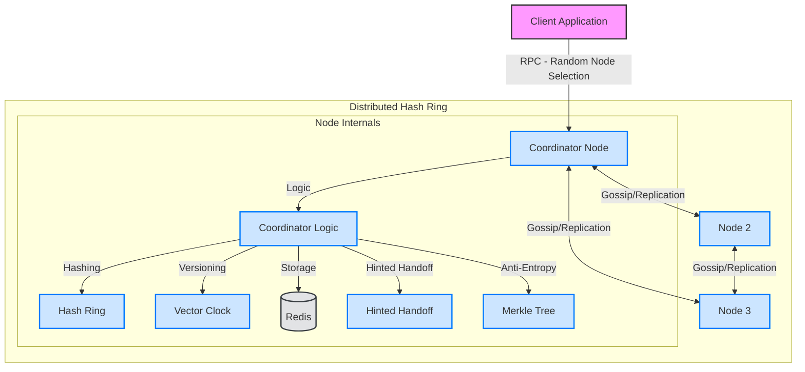

# System Architecture

```mermaid
graph TD
    %% Styling
    classDef client fill:#f9f,stroke:#333,stroke-width:2px;
    classDef lb fill:#ff9,stroke:#333,stroke-width:2px;
    classDef node fill:#cce5ff,stroke:#007bff,stroke-width:2px;
    classDef storage fill:#e2e3e5,stroke:#383d41,stroke-width:2px;

    Client[Client Application]:::client -->|RPC - Random Node Selection| Coord[Coordinator Node]:::node
    
    subgraph "Distributed Hash Ring"
        Coord <-->|Gossip/Replication| N2[Node 2]:::node
        Coord <-->|Gossip/Replication| N3[Node 3]:::node
        N2 <-->|Gossip/Replication| N3
        
        subgraph "Node Internals"
            Coord -->|Logic| Logic[Coordinator Logic]
            Logic -->|Hashing| Ring[Hash Ring]
            Logic -->|Versioning| VC[Vector Clock]
            Logic -->|Storage| Redis[(Redis)]:::storage
            Logic -->|Hinted Handoff| HH[Hinted Handoff]
            Logic -->|Anti-Entropy| MT[Merkle Tree]
        end
    end
```
