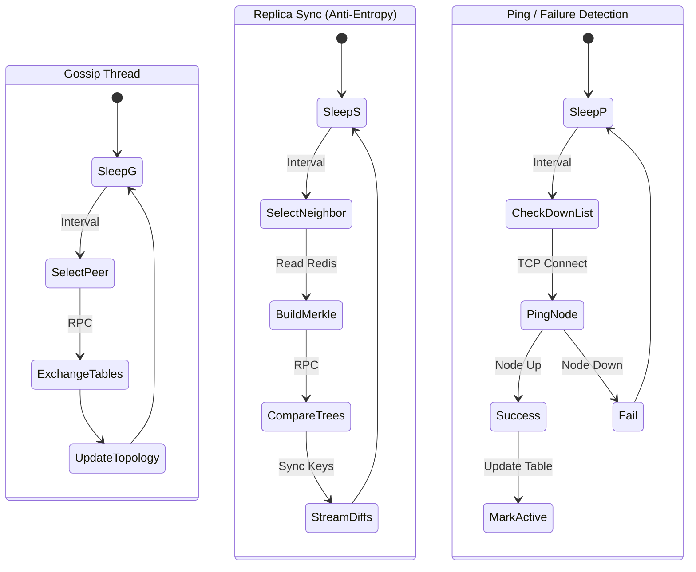

# Async Background Threads

```mermaid
stateDiagram-v2
    %% Styling
    classDef thread fill:#f5f5f5,stroke:#333,stroke-width:2px;
    
    state "Gossip Thread" as Gossip {
        [*] --> SleepG
        SleepG --> SelectPeer: Interval
        SelectPeer --> ExchangeTables: RPC
        ExchangeTables --> UpdateTopology
        UpdateTopology --> SleepG
    }
    
    state "Replica Sync (Anti-Entropy)" as Sync {
        [*] --> SleepS
        SleepS --> SelectNeighbor: Interval
        SelectNeighbor --> BuildMerkle: Read Redis
        BuildMerkle --> CompareTrees: RPC
        CompareTrees --> StreamDiffs: Sync Keys
        StreamDiffs --> SleepS
    }
    
    state "Ping / Failure Detection" as Ping {
        [*] --> SleepP
        SleepP --> CheckDownList: Interval
        CheckDownList --> PingNode: TCP Connect
        PingNode --> Success: Node Up
        PingNode --> Fail: Node Down
        Success --> MarkActive: Update Table
        Fail --> SleepP
    }
```
