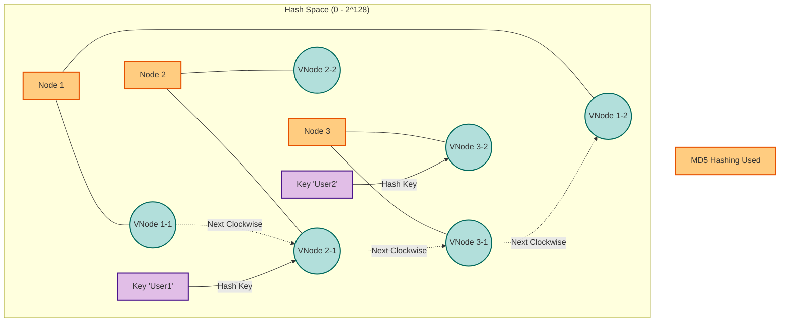

# Consistent Hashing Ring

```mermaid
graph TD
    %% Styling
    classDef ring fill:#fff,stroke:#333,stroke-width:4px;
    classDef node fill:#ffcc80,stroke:#e65100,stroke-width:2px;
    classDef vnode fill:#b2dfdb,stroke:#00695c,stroke-width:2px;
    classDef key fill:#e1bee7,stroke:#4a148c,stroke-width:2px;

    subgraph "Hash Space (0 - 2^128)"
        N1[Node 1]:::node --- VN1_1((VNode 1-1)):::vnode
        N1 --- VN1_2((VNode 1-2)):::vnode
        
        N2[Node 2]:::node --- VN2_1((VNode 2-1)):::vnode
        N2 --- VN2_2((VNode 2-2)):::vnode
        
        N3[Node 3]:::node --- VN3_1((VNode 3-1)):::vnode
        N3 --- VN3_2((VNode 3-2)):::vnode
        
        VN1_1 -.->|Next Clockwise| VN2_1
        VN2_1 -.->|Next Clockwise| VN3_1
        VN3_1 -.->|Next Clockwise| VN1_2
        
        K1[Key 'User1']:::key -->|Hash Key| VN2_1
        K2[Key 'User2']:::key -->|Hash Key| VN3_2
    end
    
    Note[MD5 Hashing Used]
```
