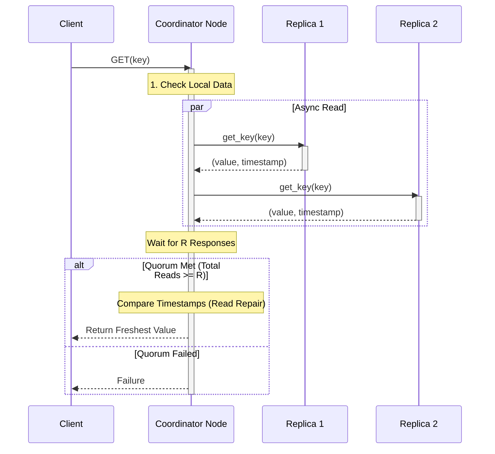

# GET Operation Sequence (Quorum R)

```mermaid
sequenceDiagram
    participant Client
    participant Coord as Coordinator Node
    participant R1 as Replica 1
    participant R2 as Replica 2
    
    Client->>Coord: GET(key)
    activate Coord
    
    Note over Coord: 1. Check Local Data
    
    par Async Read
        Coord->>R1: get_key(key)
        activate R1
        R1-->>Coord: (value, timestamp)
        deactivate R1
        
        Coord->>R2: get_key(key)
        activate R2
        R2-->>Coord: (value, timestamp)
        deactivate R2
    end
    
    Note over Coord: Wait for R Responses
    
    alt Quorum Met (Total Reads >= R)
        Note over Coord: Compare Timestamps (Read Repair)
        Coord-->>Client: Return Freshest Value
    else Quorum Failed
        Coord-->>Client: Failure
    end
    
    deactivate Coord
```
