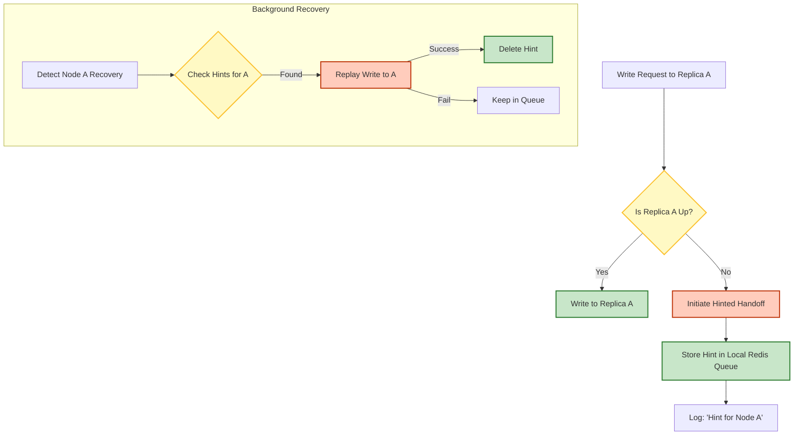

# Hinted Handoff

```mermaid
flowchart TD
    %% Styling
    classDef check fill:#fff9c4,stroke:#fbc02d,stroke-width:2px;
    classDef action fill:#ffccbc,stroke:#bf360c,stroke-width:2px;
    classDef store fill:#c8e6c9,stroke:#2e7d32,stroke-width:2px;

    Start[Write Request to Replica A] --> CheckStatus{Is Replica A Up?}:::check
    
    CheckStatus -- Yes --> Write[Write to Replica A]:::store
    
    CheckStatus -- No --> Handoff[Initiate Hinted Handoff]:::action
    Handoff --> StoreHint[Store Hint in Local Redis Queue]:::store
    StoreHint --> Log[Log: 'Hint for Node A']
    
    subgraph "Background Recovery"
        Detect[Detect Node A Recovery] --> Replay{Check Hints for A}:::check
        Replay -- Found --> Send[Replay Write to A]:::action
        Send -- Success --> Delete[Delete Hint]:::store
        Send -- Fail --> Retry[Keep in Queue]
    end
```
