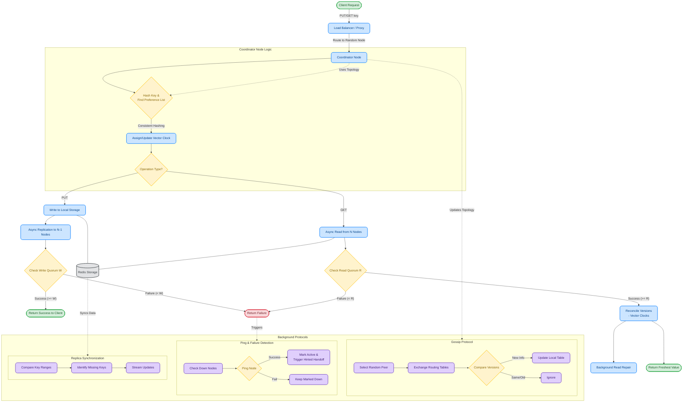

# Comprehensive System Design

This diagram integrates all major components of the distributed system: Architecture, Consistent Hashing, Vector Clocks, Quorum Logic, and Background Protocols.

```mermaid
flowchart TD
    %% --- Styling Definitions ---
    classDef startNode fill:#d4edda,stroke:#28a745,stroke-width:2px,color:#155724,rx:10,ry:10;
    classDef processNode fill:#cce5ff,stroke:#007bff,stroke-width:2px,color:#004085,rx:10,ry:10;
    classDef decisionNode fill:#fff3cd,stroke:#ffc107,stroke-width:2px,color:#856404,rx:5,ry:5,shape:diamond;
    classDef failureNode fill:#f8d7da,stroke:#dc3545,stroke-width:2px,color:#721c24,rx:10,ry:10;
    classDef storageNode fill:#e2e3e5,stroke:#383d41,stroke-width:2px,color:#383d41,shape:cylinder;
    classDef threadNode fill:#e0cffc,stroke:#6f42c1,stroke-width:2px,color:#3c1e70,rx:10,ry:10;

    %% --- Client Layer ---
    Client([Client Request]) -->|PUT/GET key| LB[Load Balancer / Proxy]
    LB -->|Route to Random Node| Coord[Coordinator Node]
    
    class Client startNode;
    class LB processNode;
    class Coord processNode;

    %% --- Coordinator Logic ---
    subgraph Coordinator_Logic [Coordinator Node Logic]
        direction TB
        Coord --> Hash{Hash Key &<br/>Find Preference List}
        Hash -->|Consistent Hashing| VClock[Assign/Update Vector Clock]
        VClock --> OpType{Operation Type?}
        
        class Hash decisionNode;
        class VClock processNode;
        class OpType decisionNode;
    end

    %% --- PUT Path ---
    OpType -- PUT --> LocalWrite[Write to Local Storage]
    LocalWrite --> AsyncRep[Async Replication to N-1 Nodes]
    AsyncRep --> QuorumCheck_W{Check Write Quorum W}
    
    QuorumCheck_W -- "Success (>= W)" --> SuccessResponse([Return Success to Client])
    QuorumCheck_W -- "Failure (< W)" --> FailResponse([Return Failure])
    
    class LocalWrite processNode;
    class AsyncRep processNode;
    class QuorumCheck_W decisionNode;
    class SuccessResponse startNode;
    class FailResponse failureNode;

    %% --- GET Path ---
    OpType -- GET --> AsyncRead[Async Read from N Nodes]
    AsyncRead --> QuorumCheck_R{Check Read Quorum R}
    
    QuorumCheck_R -- "Success (>= R)" --> Reconcile[Reconcile Versions<br/>- Vector Clocks]
    Reconcile --> ReadRepair[Background Read Repair]
    Reconcile --> ReturnValue([Return Freshest Value])
    QuorumCheck_R -- "Failure (< R)" --> FailResponse
    
    class AsyncRead processNode;
    class QuorumCheck_R decisionNode;
    class Reconcile processNode;
    class ReadRepair processNode;
    class ReturnValue startNode;

    %% --- Storage Layer ---
    LocalWrite --- Redis[(Redis Storage)]
    AsyncRead --- Redis
    
    class Redis storageNode;

    %% --- Background Threads (The "Life" of the System) ---
    subgraph Background_Threads [Background Protocols]
        direction LR
        
        subgraph Gossip_Protocol [Gossip Protocol]
            G1[Select Random Peer] --> G2[Exchange Routing Tables]
            G2 --> G3{Compare Versions}
            G3 -- New Info --> G4[Update Local Table]
            G3 -- Same/Old --> G5[Ignore]
        end
        
        subgraph Failure_Detection [Ping & Failure Detection]
            P1[Check Down Nodes] --> P2{Ping Node}
            P2 -- Success --> P3[Mark Active &<br/>Trigger Hinted Handoff]
            P2 -- Fail --> P4[Keep Marked Down]
        end
        
        subgraph Anti_Entropy [Replica Synchronization]
            S1[Compare Key Ranges] --> S2[Identify Missing Keys]
            S2 --> S3[Stream Updates]
        end
        
        class G1,G2,G4,G5,P1,P3,P4,S1,S2,S3 threadNode;
        class G3,P2 decisionNode;
    end

    %% --- Connections between Logic and Background ---
    Coord -.->|Updates Topology| Gossip_Protocol
    Coord -.->|Uses Topology| Hash
    Redis -.->|Syncs Data| Anti_Entropy
    FailResponse -.->|Triggers| Failure_Detection

```
