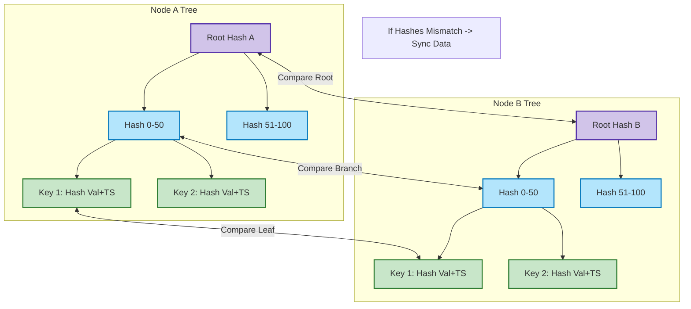

# Merkle Trees (Anti-Entropy)

```mermaid
graph TD
    %% Styling
    classDef root fill:#d1c4e9,stroke:#512da8,stroke-width:2px;
    classDef branch fill:#b3e5fc,stroke:#0277bd,stroke-width:2px;
    classDef leaf fill:#c8e6c9,stroke:#2e7d32,stroke-width:2px;

    subgraph "Node A Tree"
        RootA[Root Hash A]:::root --> L1A[Hash 0-50]:::branch
        RootA --> R1A[Hash 51-100]:::branch
        L1A --> Leaf1A[Key 1: Hash Val+TS]:::leaf
        L1A --> Leaf2A[Key 2: Hash Val+TS]:::leaf
    end
    
    subgraph "Node B Tree"
        RootB[Root Hash B]:::root --> L1B[Hash 0-50]:::branch
        RootB --> R1B[Hash 51-100]:::branch
        L1B --> Leaf1B[Key 1: Hash Val+TS]:::leaf
        L1B --> Leaf2B[Key 2: Hash Val+TS]:::leaf
    end
    
    RootA <-->|Compare Root| RootB
    L1A <-->|Compare Branch| L1B
    Leaf1A <-->|Compare Leaf| Leaf1B
    
    Note[If Hashes Mismatch -> Sync Data]
```
