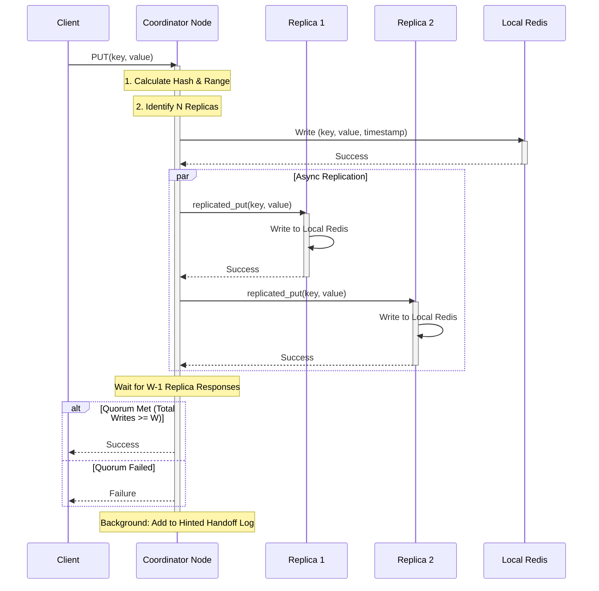

# PUT Operation Sequence (Quorum W)

```mermaid
sequenceDiagram
    participant Client
    participant Coord as Coordinator Node
    participant R1 as Replica 1
    participant R2 as Replica 2
    participant Redis as Local Redis
    
    Client->>Coord: PUT(key, value)
    activate Coord
    
    Note over Coord: 1. Calculate Hash & Range
    Note over Coord: 2. Identify N Replicas
    
    Coord->>Redis: Write (key, value, timestamp)
    activate Redis
    Redis-->>Coord: Success
    deactivate Redis
    
    par Async Replication
        Coord->>R1: replicated_put(key, value)
        activate R1
        R1->>R1: Write to Local Redis
        R1-->>Coord: Success
        deactivate R1
        
        Coord->>R2: replicated_put(key, value)
        activate R2
        R2->>R2: Write to Local Redis
        R2-->>Coord: Success
        deactivate R2
    end
    
    Note over Coord: Wait for W-1 Replica Responses
    
    alt Quorum Met (Total Writes >= W)
        Coord-->>Client: Success
    else Quorum Failed
        Coord-->>Client: Failure
    end
    
    Note over Coord: Background: Add to Hinted Handoff Log
    
    deactivate Coord
```
