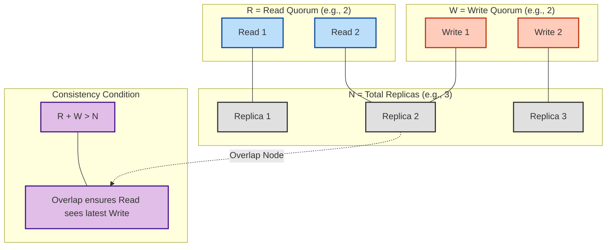

# Quorum Technique

```mermaid
graph TD
    %% Styling
    classDef n fill:#e0e0e0,stroke:#333,stroke-width:2px;
    classDef r fill:#bbdefb,stroke:#0d47a1,stroke-width:2px;
    classDef w fill:#ffccbc,stroke:#bf360c,stroke-width:2px;
    classDef overlap fill:#e1bee7,stroke:#4a148c,stroke-width:2px;

    subgraph "N = Total Replicas (e.g., 3)"
        N1[Replica 1]:::n
        N2[Replica 2]:::n
        N3[Replica 3]:::n
    end
    
    subgraph "R = Read Quorum (e.g., 2)"
        R1[Read 1]:::r --- N1
        R2[Read 2]:::r --- N2
    end
    
    subgraph "W = Write Quorum (e.g., 2)"
        W1[Write 1]:::w --- N2
        W2[Write 2]:::w --- N3
    end
    
    subgraph "Consistency Condition"
        Cond[R + W > N]:::overlap
        Overlap[Overlap ensures Read sees latest Write]:::overlap
        Cond --- Overlap
    end
    
    N2 -.->|Overlap Node| Overlap
```
