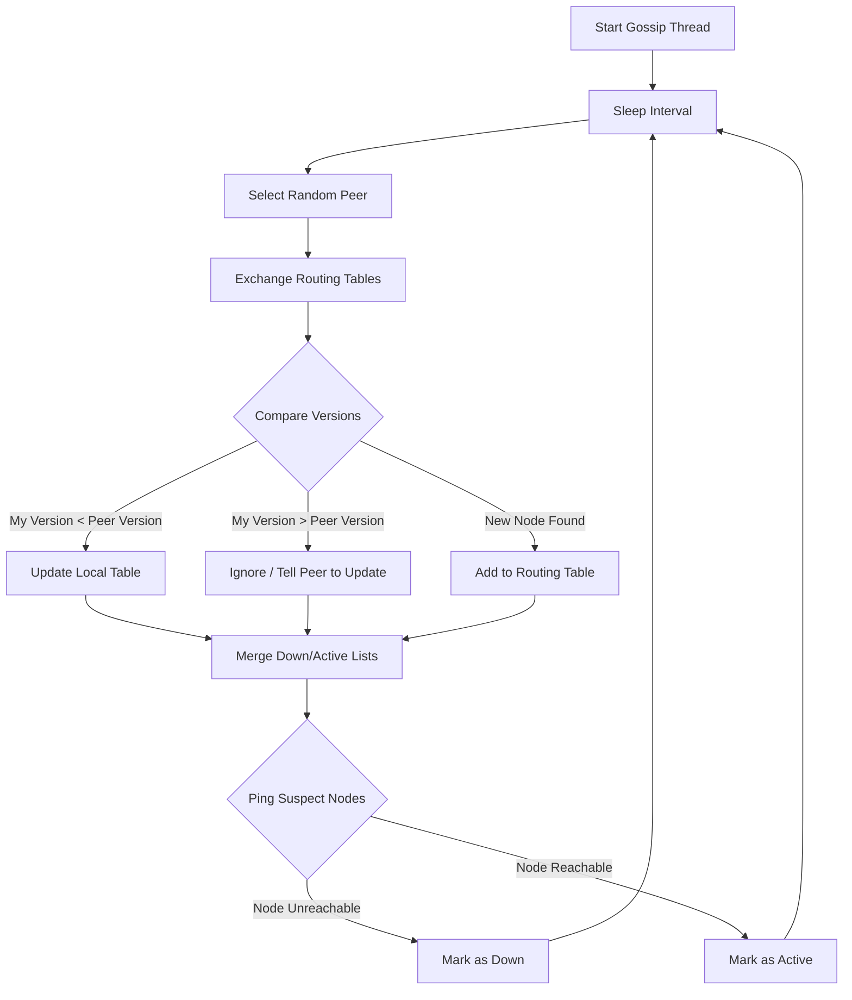

# Vector Clock & Gossip Protocol

```mermaid
flowchart TD
    Start[Start Gossip Thread] --> Sleep[Sleep Interval]
    Sleep --> Select[Select Random Peer]
    Select --> Exchange[Exchange Routing Tables]
    
    Exchange --> Compare{Compare Versions}
    
    Compare -- "My Version < Peer Version" --> Update[Update Local Table]
    Compare -- "My Version > Peer Version" --> Ignore[Ignore / Tell Peer to Update]
    Compare -- "New Node Found" --> Add[Add to Routing Table]
    
    Update --> Merge[Merge Down/Active Lists]
    Ignore --> Merge
    Add --> Merge
    
    Merge --> Ping{Ping Suspect Nodes}
    Ping -- "Node Unreachable" --> MarkDown[Mark as Down]
    Ping -- "Node Reachable" --> MarkUp[Mark as Active]
    
    MarkDown --> Sleep
    MarkUp --> Sleep
```
